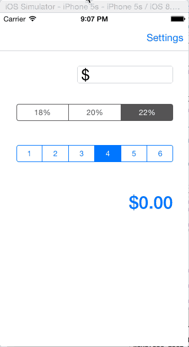

# tips
An iOS application to calculate tips based on the [video walkthrough](http://courses.codepath.com/snippets/intro_to_ios/thanks_for_applying_stanford#heading-prework) presented by CodePath

Features include tip percentage selection, and a segmented button to determine the number of people for the bill.

I put in about 2 hours of work including the video walkthrough.

